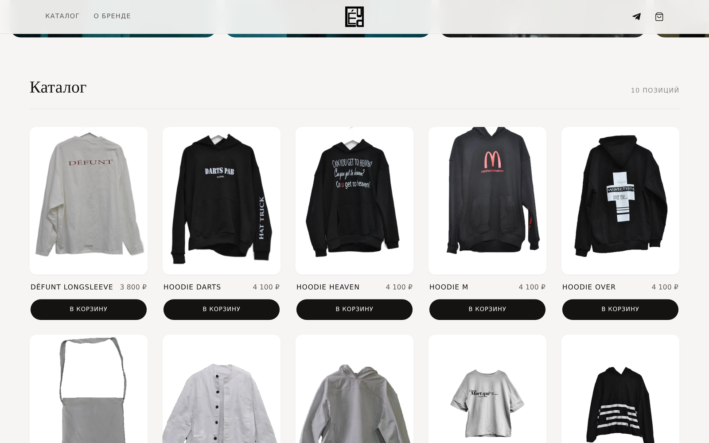

# Les Échos Du Passé — интернет-магазин одежды

Учебный проект: витрина одежды с каталогом, страницей товара и рабочей корзиной.
Без фреймворков и сборщиков — чистые HTML, CSS и JavaScript.

**Демо:** https://<ваш-логин>.github.io/ledp-shop/



## Что реализовано

**Каталог**

- Сетка карточек на CSS Grid `auto-fill` — подстраивается под любую ширину без медиазапросов на каждую колонку
- Вторая фотография товара при наведении (чистый CSS, без подмены `src` скриптом)
- Быстрый выбор размера прямо в карточке — кнопка раскрывает размеры, клик добавляет товар

**Страница товара**

- Данные подставляются по `?id=` из URL
- Галерея с миниатюрами, выбор размера, описание в аккордеоне на `<details>`
- Блок «Смотрите также»

**Корзина**

- Боковая панель, открывается по кнопке в шапке, закрывается по `Esc`, клику вне и крестику
- Изменение количества, удаление позиции, подсчёт итога
- Один товар в разных размерах — разные позиции
- Сохранение в `localStorage`: корзина переживает перезагрузку и закрытие вкладки
- Синхронизация между открытыми вкладками через событие `storage`
- Перенос данных из старого формата хранения при первом заходе

**Прочее**

- Слайдер на нативном `scroll-snap` — работает свайпом на телефоне, не требует пересчёта координат
- Адаптив от 320 px, поддержка `prefers-reduced-motion`
- Разметка с `aria`-атрибутами, видимый фокус, ссылка «к каталогу» для клавиатуры
- Изображения в WebP — 865 КБ вместо 5,3 МБ исходников

## Структура

```
.
├── index.html          витрина: обложка, слайдер, каталог, о бренде
├── product.html        карточка товара (?id=1 … ?id=10)
├── css/
│   ├── reset.css       минимальная нормализация
│   ├── style.css       оформление сайта
│   └── cart.css        боковая панель корзины
├── js/
│   ├── products.js     каталог товаров — единственный источник данных
│   ├── cart.js         корзина: состояние, localStorage, панель
│   ├── shop.js         отрисовка сетки каталога
│   ├── product.js      отрисовка страницы товара
│   └── app.js          слайдер, прелоадер, поведение шапки
└── images/             фотографии товаров и образов
```

## Архитектурные решения

**Один источник данных.** Название, цена и фотографии товара лежат только в
`js/products.js`. Каталог, страница товара и корзина читают их оттуда, поэтому
цена не может разойтись между карточкой и корзиной. В первой версии данные
вытаскивались из вёрстки через `textContent`, и цены в разных местах
действительно разошлись.

**Корзина изолирована в одном модуле.** Весь код, который трогает
`localStorage`, лежит в `cart.js`. Остальные скрипты работают через публичный
API — его удобно дёргать и из консоли:

```js
Cart.add('1', 'M', 2)   // добавить товар
Cart.items()            // текущее содержимое
Cart.total()            // сумма заказа
Cart.open()             // открыть панель
```

**Устойчивость к мусору в хранилище.** При загрузке всё, что лежит в
`localStorage`, прогоняется через нормализацию: строки вроде `"3800rub"`
превращаются в числа, дубликаты склеиваются, записи без `id` отбрасываются.
Испорченный JSON не роняет страницу — корзина просто стартует пустой.

**Разметка панели корзины создаётся скриптом.** Иначе её пришлось бы
дублировать в каждом HTML-файле, и копии неизбежно разошлись бы.

## Как добавить товар

Дописать объект в массив в `js/products.js` — больше ничего править не нужно,
карточка и страница товара появятся сами:

```js
{
  id: '11',
  name: 'NEW ITEM',
  price: 3200,
  image: 'images/cloth11.webp',
  hover: 'images/cloth11-alt.webp',   // необязательно
  sizes: ['S', 'M', 'L'],             // [] — товар одного размера
  description: '…',
  composition: '…',
  care: '…'
}
```

## Запуск

Достаточно открыть `index.html` в браузере. Для локального сервера:

```bash
python -m http.server 8000
# http://localhost:8000
```

## Публикация на GitHub Pages

Settings → Pages → Source: `Deploy from a branch` → ветка `main`, папка `/ (root)`.

## Стек

HTML5, CSS3 (Grid, Flexbox, custom properties, scroll-snap), JavaScript ES5+ без
зависимостей. Шрифты — Google Fonts (Playfair Display, Jost).

---

Фотографии одежды взяты из открытых источников и используются в учебных целях.
